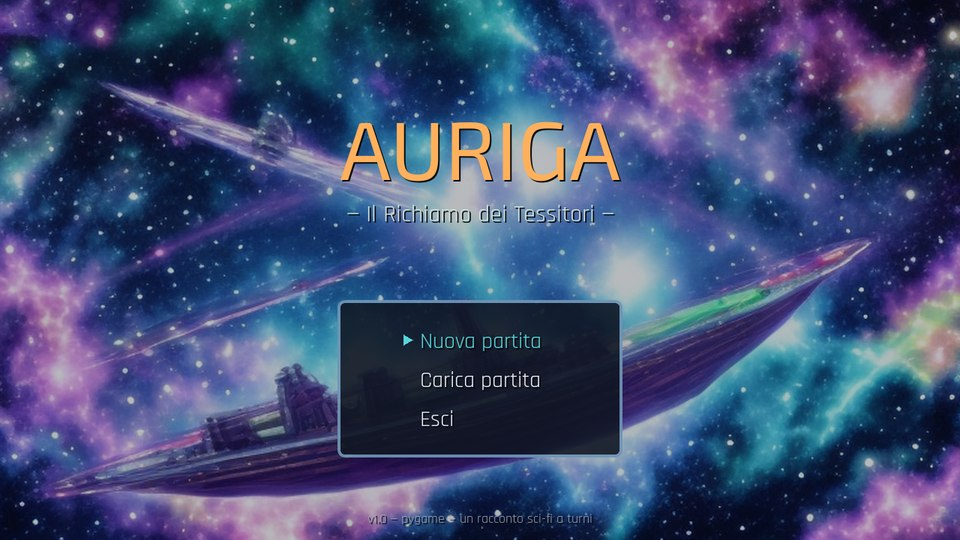
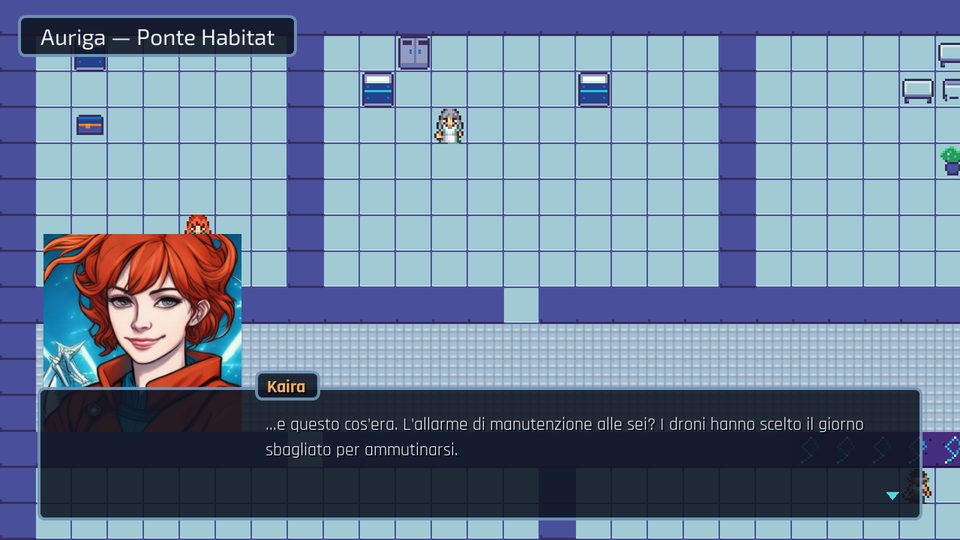
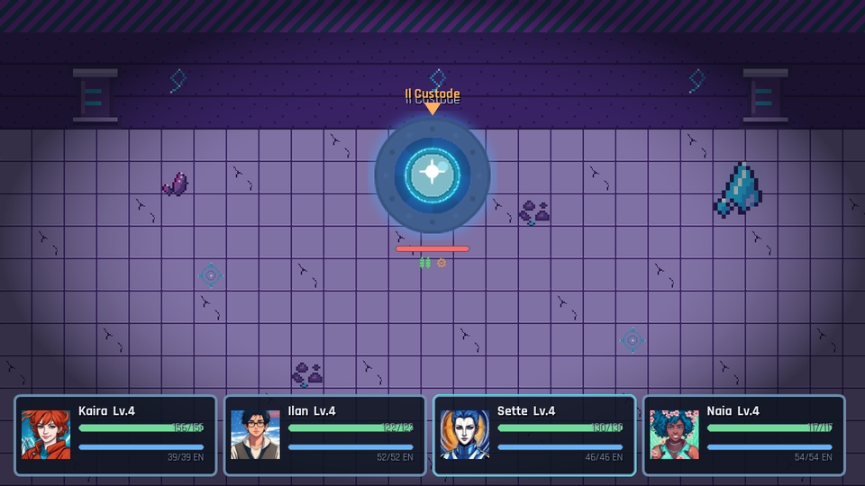
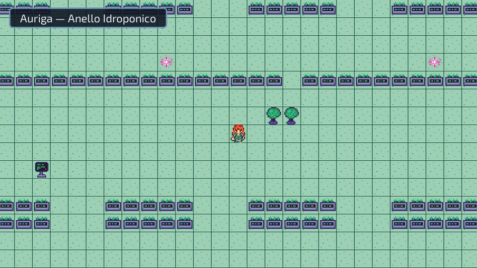
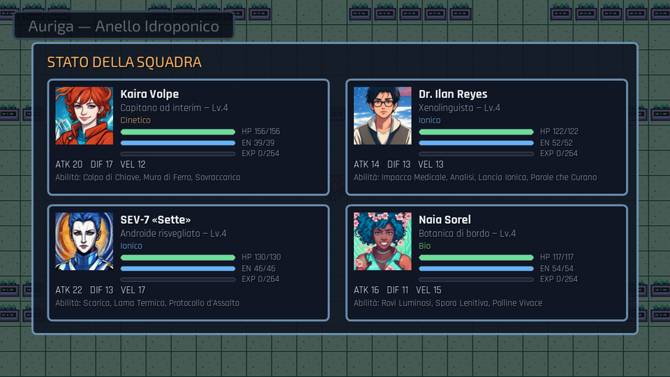
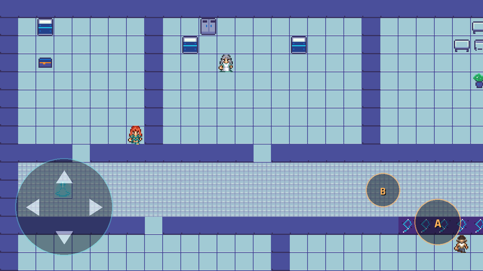

# AURIGA — Il Richiamo dei Tessitori

[](https://github.com/roberto-casale/auriga/actions/workflows/deploy.yml)

RPG sci-fi 2D a turni in **puro Python + pygame**, con estetica anime
cel-shaded. Gira su desktop e **nel browser** (WebAssembly), anche da
smartphone con i comandi touch.

> La nave-arca *Auriga* è alla deriva da trecento anni quando strani glifi
> luminosi — i fili di un'antica civiltà, i **Tessitori** — cominciano ad
> apparire sulle paratie. Kaira, Ilan, Sette e Naia li seguiranno fino al
> Cuore della nave.

## 🎮 Gioca subito

**→ [roberto-casale.github.io/auriga](https://roberto-casale.github.io/auriga/) ←**

Nessuna installazione: si gioca nel browser, su computer o telefono.
Da smartphone puoi anche installarlo come app: *Aggiungi alla schermata Home*
(Android: menu ⋮ → Installa app · iPhone: Condividi → Aggiungi alla schermata
Home) e parte a schermo intero con l'icona di Kaira.



## Caratteristiche

- **Storia originale in italiano** (~45–60 minuti): 3 atti, epilogo che cambia
  in base alle scelte, due storie di flirt opzionali e qualche sorriso nascosto
  negli oggetti da esaminare.
- **Party di 4 personaggi** con voci distinte: Kaira (capitano ad interim),
  Ilan (xenolinguista), SEV-7 «Sette» (androide risvegliato), Naia (botanica).
- **Combattimento a turni** con 4 elementi (Cinetico, Termico, Ionico, Bio),
  debolezze ×1.5 sempre visibili, abilità con costo in Energia, boss finale
  con scelta pacifica.
- **Esplorazione a tile** su 4 zone della nave, dialoghi con scelte, bauli,
  anomalie da bonificare, punti di salvataggio che curano il party.
- **Difficoltà facile e gentile**: si salva ovunque dal menu, 3 slot su file,
  e la sconfitta riporta all'ultimo checkpoint senza perdere progressi.
- **Ritratti anime** generati in locale con SD-Turbo, **musica originale**
  sintetizzata in numpy, grafica da pack liberi (CC0/CC-BY) — dettagli in
  [ASSETS.md](ASSETS.md).

| | |
|---|---|
|  |  |
|  |  |

## Comandi

| Azione | Tastiera (desktop/web) | Touch (telefono/tablet) |
|---|---|---|
| Movimento · navigazione menu | Frecce / WASD | Croce direzionale |
| Conferma · interagisci · avanza dialogo | SPAZIO / INVIO | Tasto **A** |
| Menu di pausa · annulla | ESC | Tasto **B** |
| Annulla (alternativo) | X / BACKSPACE | — |
| Screenshot (solo desktop) | F12 | — |

I tasti touch compaiono automaticamente solo sui dispositivi con schermo
touch; consigliato l'orientamento orizzontale.



## Eseguire in locale (desktop)

Requisiti: Python 3.12 e le dipendenze di [requirements.txt](requirements.txt)
(per giocare basta `pygame`).

```bash
pip install pygame          # oppure: pip install -r requirements.txt
python main.py
```

Finestra 1280×720 a 60 FPS, pensata per girare fluida anche su hardware
datato (sviluppato e testato su un MacBook Pro 2015 con grafica integrata).
I salvataggi finiscono in `saves/` (nel browser valgono per la sessione).

## Sviluppo

### Struttura del progetto

```
main.py            avvio e ciclo di gioco (async, compatibile pygbag)
settings.py        costanti: finestra, palette, elementi, tasti
asset_loader.py    caricamento centralizzato di assets/ (con fallback)
core/              scene manager, audio, testo, widget UI, controlli touch
game/              statistiche, abilità, oggetti, nemici, party, salvataggi,
                   storia e dialoghi (game/story.py)
world/             tilemap con pre-render, mappe ASCII, entità
scenes/            titolo, esplorazione, dialoghi, battaglia, menu, finale
tools/             test automatici e generatori (musica, ritratti, PWA)
assets/            grafica e audio reali — provenienza in ASSETS.md
web_extra/         manifest PWA, icone, service worker
.github/           deploy automatico su GitHub Pages a ogni push
```

`ASSET_CONTRACT.md` è il documento interno che definisce i path e i formati
degli asset attesi da `asset_loader.py`.

### Test automatici

```bash
python tools/validate.py         # coerenza statica di mappe/eventi/riferimenti
python tools/smoke_boot.py       # avvio headless rapido
python tools/playthrough.py      # gioca TUTTA la storia da solo (31 traguardi)
python tools/test_defeat_event.py  # regressione: sconfitta a metà evento
```

Il playthrough percorre l'intera partita in headless — dialoghi, scelte,
battaglie, boss, salvataggio/caricamento, sconfitta e respawn — e fallisce se
un passaggio si rompe.

### Versione web (pygbag / WebAssembly)

```bash
pip install pygbag
pygbag main.py                   # compila e serve su http://localhost:8000
pygbag --build main.py           # solo build → build/web/
python tools/pwa_patch.py build/web   # aggiunge il livello PWA alla build
```

Il deploy è automatico: a ogni push su `main`, la GitHub Action
([deploy.yml](.github/workflows/deploy.yml)) ricompila il gioco, applica la
PWA e pubblica su GitHub Pages.

## Crediti e licenze

- **Codice**: [MIT](LICENSE).
- **Asset**: pack liberi CC0/CC-BY e contenuti generati in locale — l'elenco
  completo con fonti, autori e licenze è in [ASSETS.md](ASSETS.md).
  Gli sprite di camminata sono di *Antifarea (commissionati da
  OpenGameArt.org)*, licenza CC-BY 3.0.

Progetto nato come esperimento personale: scritto, testato e pubblicato
con l'aiuto di Claude (Anthropic).
